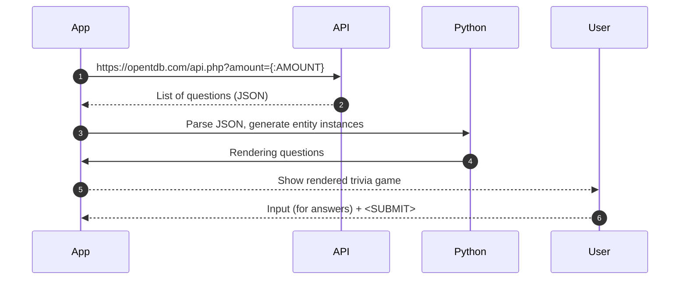

# Design & Architecture Dossier

## Sequence diagram 

```mermaid
sequenceDiagram
    autonumber
    
    App->>API: https://opentdb.com/api.php?amount={:AMOUNT}
    API-->>App: List of questions (JSON)
    App->>Python:  Parse JSON, generate entity instances 
    Python->>App:  Rendering questions
    App-->>User: Show rendered trivia game
    User-->>App: Input (for answers) + <SUBMIT>
    
```

